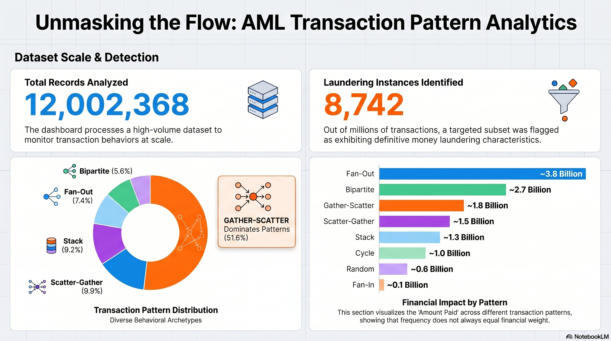

# Anti-Money Laundering (AML) Dashboard

I built this ELT pipeline and forensic dashboard to help Compliance Officers visualize illicit money flows using the IBM AML synthetic dataset.

### Live Dashboard Template
[**View the AML Dashboard in Looker Studio**](https://datastudio.google.com/u/1/reporting/78f521cd-3007-4151-9cd3-fe4a107d4e8c/page/VdnvF)

**Note on Dashboard Usage:** To use this dashboard with your own data, a Google Account with Google Cloud and BigQuery enabled is required. The link above serves as a template; once you execute the ELT pipeline, this link can be transformed into your custom dashboard URL, specifically visualizing the data hosted in your personal BigQuery environment.




---

## The Problem
Financial institutions face a massive challenge in detecting money laundering because illicit funds are often obscured through a series of "layering" transactions across multiple accounts and banks. Standard rule-based systems often fail because:
1. **Siloed Data:** Transactions are viewed in isolation rather than as a connected graph.
2. **Missing Identifiers:** Many datasets (including the IBM synthetic set) lack a native, unified Transaction ID, making it nearly impossible to join ledger data with forensic attack logs.
3. **The "Orphan" Gap:** A significant portion of laundering transactions are "orphans"—records marked as illicit but not directly tied to a known attack pattern—which standard detection systems frequently ignore.

## The Solution
This project provides an end-to-end forensic tool that transforms raw financial noise into a **"Exploratory Dashboard"** of illicit activity. 
* **Deterministic Hashing:** I engineered an 11-field hash to create a unique `transaction_id`, allowing us to bridge the gap between the primary ledger and forensic attack patterns.
* **Automated Log Parsing:** A custom Python transformer streams semi-structured text logs from GCS and flattens complex, multi-hop laundering sequences into structured data.
* **Forensic Warehouse:** By materializing a partitioned and clustered "Reports" layer in BigQuery, the system allows compliance officers to trace funds across the entire network with sub-second query performance.

---

## Project Overview
This project transforms raw synthetic financial data into a **"Dashboard"** of illicit money flows. By implementing an 11-field deterministic hashing strategy, I developed an **ELT pipeline** that allows investigators to trace funds across multiple institutions and identify complex criminal behaviors that traditional, fragmented systems often miss.

A core feature of my data preparation is the automated Python parsing script. The IBM dataset provides laundering attack patterns in a complex text format. My ELT pipeline streams this raw text directly from Google Cloud Storage, parses the specific attack blocks, flattens the nested data into tabular rows, and saves it as a clean CSV ready for BigQuery external tables.

---

---

## The Tech Stack

I selected this stack to satisfy the requirements of a production-grade cloud data platform, ensuring scalability, reproducibility, and clear separation of concerns.

* **Infrastructure as Code (IaC): Terraform**
    I use Terraform to provision the entire Google Cloud environment. This ensures that the GCS buckets and BigQuery datasets are version-controlled and can be destroyed or recreated in minutes. It eliminates configuration drift by managing resource states centrally.
* **Data Lake: Google Cloud Storage (GCS)**
    GCS acts as my landing zone for raw Kaggle data and the primary storage for my parsed CSV files. It provides a cost-effective, durable storage layer that BigQuery can query directly via external tables during the **Staging** phase.
* **Data Warehouse: BigQuery**
    BigQuery serves as the compute engine for my ELT. I utilize its massive parallel processing power to perform complex JOINs between millions of transaction records and attack typologies. I leverage its analytical features, such as partitioning and clustering, to optimize query performance for the dashboard.
* **Isolation: Docker Compose**
    I containerized the entire environment using Docker to ensure the ELT pipeline is fully portable and reproducible. I implemented a persistent architecture with a dedicated Runner and a Client container.
* **Workflow Orchestration: Bruin**
    Bruin is the brain of the ELT pipeline. I use it to manage dependencies between my Python ingestion scripts, SQL staging transformations, and final **reports** materializations. It ensures that data flows in the correct order: ingestion -> Staging -> reports.
    It helps me run basic data tests and enforce schema.
* **Visualization: Looker Studio (formerly Data Studio)**
    I chose Looker Studio to provide a real-time interface for Compliance Officers. I have implemented forensic charts to satisfy requirements: a network flow visualization and a high-risk transaction ledger. These connect directly to my partitioned BigQuery tables.
* **Package Management: uv**
    I use uv for lightning-fast Python dependency management and reproducible virtual environments, ensuring that my parsing and ingestion scripts run consistently across local and Docker environments.
* **Scripted Setup & Run: Make**
    I used Make with a bash script to guide reviewers/users to a smooth setup, ensuring environment variables all lock in correctly.

---

## The Dataset (IBM Synthetic AML Data)
**Source:** IBM Transactions for Anti Money Laundering (AML)
[**Kaggle Source**](https://www.kaggle.com/datasets/ealtman2019/ibm-transactions-for-anti-money-laundering-aml)

Money laundering is a multi-billion dollar issue, yet access to real financial transaction data is highly restricted for both proprietary and privacy reasons. Detection is notoriously difficult as automated algorithms often have high false positive and false negative rates. This synthetic transaction data from IBM avoids these problems by modeling a virtual world inhabited by individuals, companies, and banks.

### Forensic Discovery: The Orphan Record Challenge
A critical discovery I made during the development of this ELT was that a significant volume of records marked `is_laundering = 1` in the core ledger are **not** associated with any of the 8 defined attack patterns in the raw logs. 

The data generator tracks funds derived from illicit activity through arbitrarily many transactions, creating the ability to label laundering transactions many steps removed from their illicit source. These "orphan" laundering records indicate either background noise generated by the simulator or secondary illicit activities. Identifying these required robust record-matching logic and revealed a gap that standard rule-based systems would fail to categorize.

### Dataset Characteristics
I used this data because it models the full money laundering cycle:
* **Placement:** Sources like smuggling of illicit funds.
* **Layering:** Mixing the illicit funds into the financial system.
* **Integration:** Spending the illicit funds.

The content is divided into groups:
* **Group HI:** Higher illicit ratio (more laundering).
* **Group LI:** Lower illicit ratio (less laundering).
Each contains Small (~5M transactions), Medium (~32M), and Large (~180M) sets. I focused on the HI-Small set for this implementation.

### Citations
If you use these datasets, please cite the following works as requested by the IBM team:
* Paper describing generation of data (Neurips 2023).
* Github Site with GNN Models to Predict Laundering.
* Provably Powerful Graph Neural Networks for Directed Multigraphs.

---

## ELT Architecture & Implementation

## Ingestion Layer: The Data Gateway

The ingestion layer is the point of entry for the raw synthetic data. It handles the secure acquisition of the IBM dataset from external sources and ensures it is safely landed in our cloud storage environment before any transformations occur.


### 1. ingest_kaggle_small.py (Python Collector)
This script acts as the automated data fetcher for the pipeline.
* **Function:** It uses the Kaggle API to authenticate and pull the "HI-Small" dataset files directly from the source, streaming them into the `raw/` directory of our Google Cloud Storage bucket.
* **Impact:** It eliminates the need for manual downloads and provides a reproducible way to fetch the data. By streaming directly to GCS, it avoids local storage bottlenecks and ensures the raw data remains immutable and archived for audit purposes.


---

## Staging Layer: The Forensic Engine Room

The staging layer is where raw, semi-structured data is transformed into a clean, relational format ready for forensic analysis. Each asset in this layer is designed to enforce schema, handle deduplication, and generate the unique identifiers required to bridge disparate data sources.

### 1. convert_patterns_to_csv.py (Python Transformer)
This script handles the most complex data challenge in the project: the semi-structured "Attack Pattern" logs provided by the IBM simulator.
* **Function:** It performs a stream-parse of raw text logs from GCS, using regular expressions to identify "Alert" blocks and extract hop-by-hop transaction details.
* **Impact:** It flattens nested laundering sequences—where funds move through multiple intermediary accounts—into a structured tabular format. Without this, the high-level typologies like "Fan-In" or "Cycle" would remain trapped in unstructured text.

### 2. create_external_tables.sql (SQL DDL)
This asset establishes the initial link between the GCS data lake and the BigQuery warehouse.
* **Function:** It defines the Data Definition Language (DDL) for BigQuery External Tables, pointing directly to the CSV and TXT files in storage.
* **Impact:** It allows the pipeline to query raw data without the cost and overhead of permanent ingestion. This provides a "zero-copy" entry point for the staging environment.

### 3. stg_small_trans.sql (SQL Normalization)
The core ledger normalization asset. This is where the deterministic 11-field hashing strategy is implemented.
* **Function:** It cleans raw transaction data, deduplicates records, and generates the `transaction_id` using the `FARM_FINGERPRINT` algorithm.
* **Impact:** By creating a unique ID from the transaction attributes (Timestamp, Banks, Accounts, and Amounts), it allows us to match ledger records against parsed attack logs.

### 4. stg_small_patterns.sql (SQL Type Casting)
This asset processes the output from the Python parser to ensure data quality before materialization.
* **Function:** It casts the parsed string data into proper BigQuery types (TIMESTAMP, FLOAT64) and applies initial filters.
* **Impact:** It serves as the primary source for laundering "Alert" metadata, ensuring that every identified attack has a consistent schema for downstream JOINs.

### 5. stg_small_attacks.sql (SQL Bridge)
The bridge table that links unique transactions to their specific laundering "Alert" IDs.
* **Function:** It maps individual `transaction_id` hashes to their corresponding `attack_id`.
* **Impact:** This is the intersection that allows an investigator to see a single transaction in the dashboard and immediately trace it back to a specific criminal typology (e.g., a "Scatter-Gather" attack).

### 6. stg_small_accounts.sql (SQL Entity Resolution)
A normalization asset focused on entity-level analysis.
* **Function:** It extracts distinct account identifiers from both source and destination fields of the ledger.
* **Impact:** By creating a unified list of accounts, it enables the "Walkable Graph" functionality, allowing investigators to track a specific account's history across multiple layering steps.

### 7. ref_small_attack_patterns.sql (SQL Reference)
The reference enrichment layer.
* **Function:** It maps the raw pattern codes extracted from logs to human-readable typology descriptions.
* **Impact:** This enriches the final report with categorical data, enabling the dashboard to be filtered by specific laundering behaviors like "Bipartite" or "Single-Large" transfers.

## Reports Layer: The Forensic Interface

The reports layer is the final destination for the data. This is where the heavy lifting of the Staging layer pays off, resulting in highly optimized, materialized tables that power the Looker Studio forensic dashboard.


### 1. all_transactions.sql (SQL Materialization)
This is the "Master Table" of the entire project. It combines the normalized ledger with the parsed laundering patterns and human-readable descriptions.
* **Function:** It performs a massive three-way JOIN between the transactions, the laundering alerts, and the typology references. It uses explicit casting to ensure that the final output is partitioned by month and clustered by account.
* **Impact:** This table is the "Single Source of Truth" for the dashboard. The **Partitioning** ensures that Looker Studio only queries the relevant months of data, while **Clustering** ensures that forensic "walks" through a specific account's history are lightning-fast. It successfully identifies the "orphan" records by showing transactions that were marked as laundering but lack a matching simulated pattern.


---

### Python Scripting & CSV Creation
The IBM dataset presents a unique challenge: while transactions are provided as CSVs, the "Attack Patterns" are stored in raw, semi-structured text logs. A standard loader cannot interpret these.

**The Parsing Strategy:** My `convert_patterns_to_csv.py` script serves as a custom transformer within the ELT. It performs a stream-parse of raw text logs from Google Cloud Storage:
1. Block Identification: Scans for specific Alert markers indicating the start of a laundering sequence.
2. Attribute Extraction: Uses Regex to pull Step, Amount, Source, and Destination for every hop in the chain.
3. CSV Creation: It flattens nested, multi-hop events into structured CSV rows and streams them back to GCS via my `gcs_utils.py` library.

### Data Forensic Logic: Hashing & Matching
Since the dataset lacks a native `transaction_id`, I engineered a deterministic 64-bit integer hash to act as the primary key. This hash is the **only way** to perform the complex JOIN logic required to link the primary transaction ledger with the parsed attack patterns and typology descriptions.

```sql
-- Deterministic Hashing Snippet from staging.stg_small_trans
        FARM_FINGERPRINT(
            CONCAT(
                COALESCE(CAST(Timestamp AS STRING), ''),
                COALESCE(CAST(CAST(From_Bank AS INT64) AS STRING), ''),
                COALESCE(TRIM(CAST(Account AS STRING)), ''),
                COALESCE(CAST(CAST(To_Bank AS INT64) AS STRING), ''),
                COALESCE(TRIM(CAST(Account_4 AS STRING)), ''),
                COALESCE(CAST(Amount_Paid AS STRING), '')
            )
        ) AS transaction_id,
```

### Performance Engineering
To optimize the Looker Studio experience, using Bruin I materialized the **reports** layer as physical tables rather than views. I use **Partitioning** (by month) and **Clustering** (the presort feature) to group transaction nodes together, ensuring that an investigator searching for a specific account's history finds those records stored in adjacent blocks.

```sql
-- reports.all_transactions highlighting the JOIN and Matching
/* @bruin
name: DTST.all_transactions
type: bq.sql
materialization:
  type: table
  partition_by: "TIMESTAMP_TRUNC(transaction_timestamp, MONTH)"
  cluster_by: ["transaction_timestamp", "Account"]
depends:
  - DTST.stg_small_trans
  - DTST.stg_small_attacks
  - DTST.ref_small_attack_patterns
@bruin */
SELECT 
    t.Timestamp AS transaction_timestamp, -- Clean reference to the already-parsed timestamp
    t.From_Bank,
    t.Account,
    t.To_Bank,
    t.Account_4,               
    t.Amount_Received,
    t.Receiving_Currency,
    t.Amount_Paid,
    t.Payment_Currency,
    t.Payment_Format,
    t.Is_Laundering,
    t.transaction_id,
    t.risk_type,
    t.dataset_size,
    a.attack_id,
    a.pattern_name,
    a.attack_details,
    p.pattern_description,
    CASE 
        WHEN t.Is_Laundering = 1 THEN 'High Alert'
        ELSE 'Normal'
    END as status
FROM `{{ var.GCP_PROJECT_ID }}.{{ var.BQ_DATASET }}.stg_{{ var.DATASET_SIZE | lower }}_trans` t
LEFT JOIN `{{ var.GCP_PROJECT_ID }}.{{ var.BQ_DATASET }}.stg_{{ var.DATASET_SIZE | lower }}_attacks` a
  ON t.attack_id = a.attack_id
LEFT JOIN `{{ var.GCP_PROJECT_ID }}.{{ var.BQ_DATASET }}.ref_{{ var.DATASET_SIZE | lower }}_attack_patterns` p
  ON a.pattern_name = p.pattern_name
```

---

## Laundering Attack Patterns
My ELT identifies 8 distinct criminal typologies:
1. Fan-Out: A single source distributes funds to many destination accounts.
2. Fan-In: Multiple accounts consolidate funds into a single gatherer account.
3. Cycle: Funds move through a chain (A -> B -> C -> A) to obscure the trail.
4. Bipartite: A complex mixing network between multiple sources and destinations.
5. Scatter-Gather: Rapid fan-out followed by a quick consolidation.
6. Gather-Scatter: Consolidation followed by immediate redistribution.
7. Random: Simulated noise used to test detection accuracy.
8. Single: A direct, high-volume illicit transfer between two points.

---

## Execution Guide

### Docker Compose Flow (Daisy-Chain)
The `dc-go` command is the recommended interactive way to walk through the ELT. I built this to automate the sequence.
Ensure you have your Google Cloud Service Account key in the `keys/` folder and your Kaggle API credentials ready.

## One-Click Dashboard Deployment

I have implemented the **Looker Studio Linking API** to automate the connection between your BigQuery environment and the visualization layer.

### Dockerized Deployment Steps
1. **Run the Pipeline:** Ensure `make dc-go` has finished successfully.
2. **Generate Your Link:** Run `make dc-dashboard` in your terminal.
3. **Automated Handshake:** Click the generated custom link. 
    * This URL automatically carries your `GCP_PROJECT_ID` and `BQ_DATASET` metadata to Looker Studio.
4. **Finalize:** * Click **Create Report** in the top right.
    * Click **Add to Report** to authorize the BigQuery connector.
    * Your forensic data will populate immediately.


| Command | Description |
| :--- | :--- |
| make dc-go | Chained command: Starts services and executes setup, infra, and ELT pipeline. |
| make dc-build | Builds the Runner and Client images. |
| make dc-setup | Interactive configuration of GCP and Kaggle credentials inside Docker. |
| make dc-dashboard | Fetches the custom live dashboard URL from the Client container. |
| make dc-down | Stops services and cleans up local Docker volumes. |
| make dc-clean | Deep clean: Purges Docker artifacts and destroys cloud resources. |

> [!IMPORTANT]
> **Authentication Note:** If you use multiple Google Accounts/Chrome Profiles, do not click the link directly from your terminal. Instead, **copy and paste the URL** into a browser tab where you are already logged into the Google Cloud Console. Looker Studio must be able to "see" your BigQuery tables using your current session.
---

## Local Deployment Guide

If you prefer to run the pipeline directly on your host machine rather than via Docker, follow this sequence.
Ensure you have your Google Cloud Service Account key in the `keys/` folder and your Kaggle API credentials ready.

1. **Setup:** Ensure `make setup` and `make infra` have finished successfully.
2. **Run Pipeline** Run `make pipeline` for end-to-end ELT pipeline run.
3. **Generate Your Link:** Run `make dashboard` in your terminal.
4. **Automated Handshake:** Click the generated custom link. 
    * This URL automatically carries your `GCP_PROJECT_ID` and `BQ_DATASET` metadata to Looker Studio.
5. **Finalize:** * Click **Create Report** in the top right.
    * Click **Add to Report** to authorize the BigQuery connector.
    * Your forensic data will populate immediately.
    
> [!IMPORTANT]
> **Authentication Note:** If you use multiple Google Accounts/Chrome Profiles, do not click the link directly from your terminal. Instead, **copy and paste the URL** into a browser tab where you are already logged into the Google Cloud Console. Looker Studio must be able to "see" your BigQuery tables using your current session.

| Command | Description |
| :--- | :--- |
| make setup | This interactive command installs the necessary tools (uv, Terraform, Bruin), creates your `.env` file, and sets up Python. |
| make infra | Deploy the required Google Cloud Storage buckets and BigQuery datasets using Terraform.
| make pipeline | Run the full ELT process (Ingestion -> Staging -> Reports) using the Bruin orchestrator.
| make dashboard | Fetch the Looker Studio custom link that auto connecta to your BQ dataset. |
| make clean | To avoid ongoing cloud costs, destroy all provisioned GCP resources when finished. |

---

## Full Project Structure & Asset Directory

```text
.
├── Dockerfile                  # Multi-stage build for all core ELT tools
├── LICENSE
├── Makefile                    # Solo project automation orchestrator
├── README.md                   # Project documentation
├── docker-compose.yaml         # Runner/Client persistent architecture
├── pyproject.toml              # Python dependencies managed via uv
├── uv.lock                     # Lockfile for reproducible builds
├── .bruin.yml                  # Bruin CLI project configuration
├── .env                        # Generated Single Source of Truth for the ELT
├── bruin-pipeline1
│   ├── pipeline.yml            # ELT Pipeline definition and schedule
│   ├── shared
│   │   └── gcs_utils.py        # Shared Python utility for GCS streaming
│   ├── assets
│   │   ├── ingestion
│   │   │   └── ingest_kaggle_small.py    # Python script: Streams raw data to GCS
│   │   ├── staging
│   │   │   ├── convert_patterns_to_csv.py # Python script: Custom Patterns Parser
│   │   │   ├── create_external_tables.sql # DDL: GCS -> BigQuery linkage
│   │   │   ├── ref_small_attack_patterns.sql # Pattern descriptions reference
│   │   │   ├── stg_small_accounts.sql     # Account normalization
│   │   │   ├── stg_small_attacks.sql      # Bridge: Unique Trans to Attack Labels
│   │   │   ├── stg_small_patterns.sql     # Staged raw attack patterns
│   │   │   └── stg_small_trans.sql        # Trans cleaning, deduplication & Hashing
│   │   └── reports
│   │       └── all_transactions.sql      # reports Layer (Partitioned/Clustered Table)
├── images
│   └── aml-pmg-dashboard.png      # Dashboard visual
├── keys
│   ├── aml-dash-8888-997342dff4de.json    # GCP Service Account Key
│   └── kaggle-api-key.json                # Kaggle API Credentials
├── scripts
│   └── setup.sh                           # Interactive environment builder
└── terraform
    ├── main.tf                            # IaC: GCP Bucket and BigQuery Dataset
    └── variables.tf                       # IaC: Dynamic Terraform variables
```

---

## Future Roadmap
* **Red Panda Integration:** I plan to integrate Red Panda to simulate real-time streaming, allowing the ELT to detect laundering patterns as transactions occur.
* **Monthly Batch Processing:** I am working on a 30-day automated trigger to ingest and process new financial transaction batches.
* **ML Pattern Training:** I intend to implement a machine learning training step that uses the orphan laundering records I discovered to automatically categorize and create new typologies.
* **Graph Database Integration:** I want to move from BigQuery to a dedicated graph database like Neo4j for deeper relationship analysis.
* **Walk-Through:** Creating a step-by-step guided demo for new users.