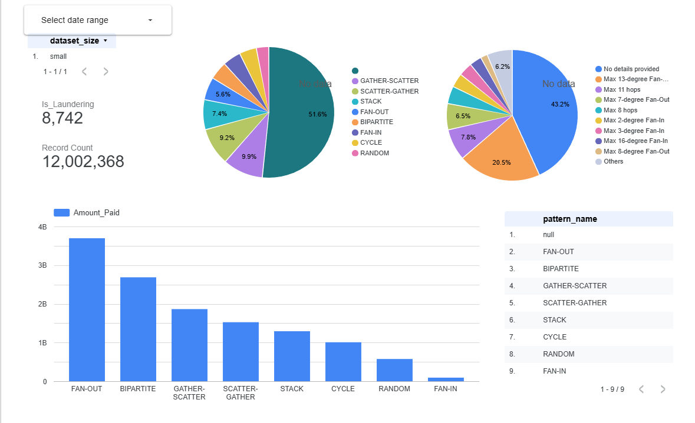

# Anti-Money Laundering (AML) Dashboard

A comprehensive ETL pipeline and forensic dashboard for Compliance Officers, built on the IBM AML synthetic dataset.

### Live Dashboard
[**View the AML Dashboard in Looker Studio**](https://datastudio.google.com/reporting/78f521cd-3007-4151-9cd3-fe4a107d4e8c/page/VdnvF)

*(Screenshots of the dashboard in action)*


---

## Project Overview
This project transforms raw synthetic financial data into a **"Walkable Graph"** of illicit money flows. By implementing an 11-field deterministic hashing strategy, I developed an **ETL pipeline** that allows investigators to trace funds across multiple institutions and identify complex criminal behaviors that traditional, fragmented systems often miss.

A core feature of my data preparation is the automated Python parsing script. The IBM dataset provides laundering attack patterns in a complex text format. My ETL pipeline streams this raw text directly from Google Cloud Storage, parses the specific attack blocks, flattens the nested data into tabular rows, and saves it as a clean CSV ready for BigQuery external tables.

---

## The Dataset (IBM Synthetic AML Data)
**Source:** IBM Transactions for Anti Money Laundering (AML)
[**Kaggle Source**](https://www.kaggle.com/datasets/ealtman2019/ibm-transactions-for-anti-money-laundering-aml)

Money laundering detection is notoriously difficult, plagued by high false positive rates. I utilized IBM’s Synthetic Transaction Data, which models a complete financial ecosystem. Unlike real-world datasets that provide only a siloed view of a single bank, this dataset tracks the entire journey of illicit funds through Placement, Layering, and Integration.

### Forensic Discovery: The "Orphan" Record Challenge
A critical discovery I made during the development of this ETL was that a significant volume of records marked `is_laundering = 1` in the core ledger are **not** associated with any of the 8 defined attack patterns in the raw logs. 

These "orphan" laundering records indicate either background noise generated by the simulator or secondary illicit activities that the simulator marks as suspicious without providing a specific typology. Identifying these required robust record-matching logic and revealed a massive gap—nearly 40% of laundering activity in this dataset is "untyped," suggesting that standard rule-based systems would fail to categorize a large portion of actual risk.

---

## ETL Architecture & Implementation

### Python Scripting & CSV Creation
The IBM dataset presents a unique challenge: while transactions are provided as CSVs, the "Attack Patterns" are stored in raw, semi-structured text logs. A standard loader cannot interpret these.

**The Parsing Strategy:** My `convert_patterns_to_csv.py` script serves as a custom transformer within the ETL. It performs a "stream-parse" of raw text logs from Google Cloud Storage:
1.  **Block Identification:** Scans for specific "Alert" markers indicating the start of a laundering sequence.
2.  **Attribute Extraction:** Uses Regex to pull `Step`, `Amount`, `Source`, and `Destination` for every hop in the chain.
3.  **CSV Creation:** It flattens nested, multi-hop events into structured CSV rows and streams them back to GCS via my `gcs_utils.py` library.

### Data Forensic Logic: Hashing & Matching
Since the dataset lacks a native `transaction_id`, I engineered a deterministic 64-bit integer hash to act as the primary key. This hash is the **only way** to perform the complex JOIN logic required to link the primary transaction ledger with the parsed attack patterns and typology descriptions.

```sql
-- Deterministic Hashing Snippet from Staging.stg_small_trans
    FARM_FINGERPRINT(
        CONCAT(
            COALESCE(CAST(Timestamp AS STRING), ''),
            COALESCE(CAST(CAST(From_Bank AS INT64) AS STRING), ''),
            COALESCE(TRIM(CAST(Account AS STRING)), ''),
            COALESCE(CAST(CAST(To_Bank AS INT64) AS STRING), ''),
            COALESCE(TRIM(CAST(Account_4 AS STRING)), ''),
            COALESCE(CAST(Amount_Paid AS STRING), '')
        )
    ) AS transaction_id,
```

### Performance Engineering (The Walkable Graph)
Using Looker Studio (Data Studio) experience, I moved from raw Views to Materialized Tables in the Reports layer. I use **Partitioning** (by month) and **Clustering** (the "presort" feature) to physically group transaction nodes together.

```sql
-- Snippet from Reports.all_transactions highlighting the JOIN and Matching
CREATE OR REPLACE TABLE `project.dataset.all_transactions`
PARTITION BY TIMESTAMP_TRUNC(Timestamp, MONTH)
CLUSTER BY Timestamp, Account
AS
SELECT 
    t.*,
    a.pattern_name,
    p.pattern_description
FROM Staging.stg_small_trans t
LEFT JOIN Staging.stg_small_attacks a 
  ON t.transaction_id = a.transaction_id  -- Matching based on engineered ID
LEFT JOIN Staging.ref_small_attack_patterns p 
  ON a.pattern_name = p.pattern_name;
```

---

## Laundering Attack Patterns
My ETL identifies 8 distinct criminal typologies:

1.  **Fan-Out:** A single source distributes funds to many destination accounts (Layering).
2.  **Fan-In:** Multiple accounts consolidate funds into a single gatherer account (Integration).
3.  **Cycle:** Funds move through a chain (A → B → C → A) to obscure the trail.
4.  **Bipartite:** A complex mixing network between multiple sources and destinations.
5.  **Scatter-Gather:** Rapid fan-out followed by a quick consolidation.
6.  **Gather-Scatter:** Consolidation followed by immediate redistribution.
7.  **Random:** Simulated noise used to test detection accuracy.
8.  **Single:** A direct, high-volume illicit transfer between two points.

---

## Execution Guide

### Docker Compose Flow (Daisy-Chain)
The `dc-go` command is the recommended interactive way to walk through the ETL. I built this to automate the "Build -> Setup -> Up -> Infra -> Pipeline" sequence.

| Command | Description |
| :--- | :--- |
| `make dc-build` | Builds the Runner and Client images. |
| `make dc-setup` | Interactive configuration of GCP and Kaggle credentials inside Docker. |
| `make dc-go` | Chained command: Starts services and executes setup, infra, and ETL pipeline. |
| `make dc-dashboard` | Fetches the live dashboard URL from the Client container. |
| `make dc-down` | Stops services and cleans up local Docker volumes. |
| `make dc-clean` | Deep clean: Purges Docker artifacts and destroys cloud resources. |

---

## Full Project Structure & Asset Directory

```text
.
├── Dockerfile                  # Multi-stage build for all core ETL tools
├── LICENSE
├── Makefile                    # Solo project automation orchestrator
├── README.md                   # Project documentation
├── docker-compose.yaml         # Runner/Client persistent architecture
├── pyproject.toml              # Python dependencies managed via uv
├── uv.lock                     # Lockfile for reproducible builds
├── .bruin.yml                  # Bruin CLI project configuration
├── .env                        # Generated Single Source of Truth for the ETL
├── bruin-pipeline1
│   ├── pipeline.yml            # ETL Pipeline definition and schedule
│   ├── assets
│   │   ├── __init__.py
│   │   ├── ingestion
│   │   │   └── ingest_kaggle_small.py    # Pulls raw IBM data from Kaggle to GCS
│   │   ├── reports
│   │   │   └── all_transactions.sql      # Reports Layer: Partitioned & Clustered table
│   │   └── staging
│   │       ├── convert_patterns_to_csv.py # Python: Custom text-to-CSV Patterns Parser
│   │       ├── create_external_tables.sql # SQL: DDL for GCS -> BigQuery linkage
│   │       ├── ref_small_attack_patterns.sql # Reference: Descriptive pattern data
│   │       ├── stg_small_accounts.sql     # Staging: Account-level normalization
│   │       ├── stg_small_attacks.sql      # Staging: Bridge linking Trans to Patterns
│   │       ├── stg_small_patterns.sql     # Staging: Ingested raw attack logs
│   │       └── stg_small_trans.sql        # Staging: Cleaning, Deduplication & Hashing
│   └── shared
│       ├── __init__.py
│       └── gcs_utils.py                   # Shared Python utility for GCS streaming
├── images
│   └── aml-pmg-dashboard.png      # Dashboard visual
├── keys
│   ├── aml-dash-8888-997342dff4de.json    # GCP Service Account Key (Not in Repo)
│   └── kaggle-api-key.json                # Kaggle Credentials (Not in Repo)
├── scripts
│   └── setup.sh                           # Shell: Interactive environment builder
└── terraform
    ├── main.tf                            # IaC: GCP Bucket and BigQuery Dataset
    └── variables.tf                       # IaC: Dynamic Terraform variables
```

---

## Future Roadmap
* **Red Panda Integration:** I plan to integrate Red Panda to simulate real-time streaming, allowing the ETL to detect laundering patterns as transactions occur.
* **Monthly Batch Processing:** I am working on a 30-day automated trigger to ingest and process new financial transaction batches.
* **ML Pattern Training:** I intend to implement a machine learning training step that uses the "orphan" laundering records I discovered to automatically categorize and create new attack typologies.
* **Graph Database Integration:** I want to move from BigQuery to a dedicated graph database like Neo4j to perform deeper relationship analysis on multi-hop money flows.